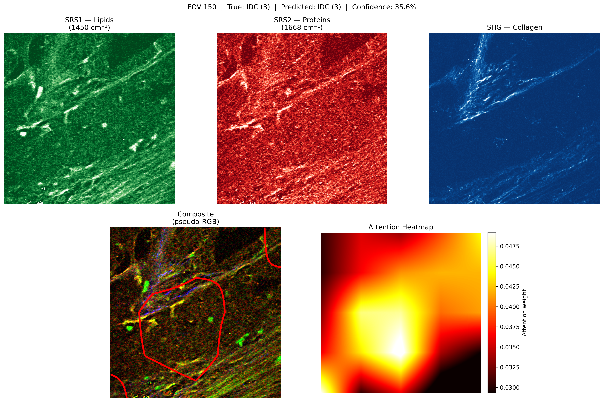
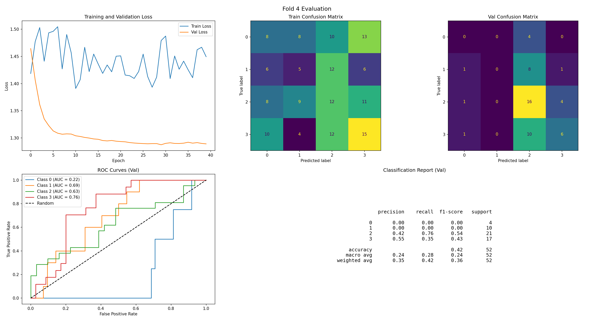

# COMP 4107 – Group 5

Label-free histological identification of intraductal carcinoma of the prostate using deep learning on multimodal stimulated Raman scattering microscopy (LAMPE Lab @ Carleton University)





## Getting Started

### Primary Docker/Jupyter workflow

The preferred way to run the Grad-CAM notebook is through Docker Compose. First create a local `.env` with your host-side dataset/model paths, then start Jupyter:

```bash
cp .env.example .env
# edit LAMPE_HOST_DATASET_DIR, LAMPE_HOST_MODEL_PATH, and JUPYTER_TOKEN
docker compose up --build jupyter
```

Then open the Jupyter URL from the logs and run:

```text
playground/gradcam_inference.ipynb
```

The notebook uses these clean, hardcoded paths inside the container:

- Dataset: `/data/lampe/dataset`
- Model checkpoint: `/data/lampe/model_v2.pth`

`compose.yaml` bind-mounts host files/directories to those container paths. The host paths can be anywhere and belong only in your local `.env`; the values in `.env.example` are examples.

Direct DMZ/LAN access remains available on `http://<host>:8888` because `compose.yaml` keeps the `8888:8888` port bind.

### Optional Cloudflare Tunnel

To expose Jupyter on your own domain without opening another inbound port, run the optional `cloudflared` sidecar.

1. In the Cloudflare Zero Trust dashboard, create a **Cloudflare Tunnel**.
2. Add a public hostname, for example `jupyter.example.com`.
3. Route that hostname to the Docker service URL:

   ```text
   http://jupyter:8888
   ```

4. Copy the tunnel token into `.env`:

   ```env
   CLOUDFLARE_TUNNEL_TOKEN=your-cloudflare-tunnel-token
   JUPYTER_TOKEN=use-a-long-random-token
   ```

5. Start Jupyter plus the tunnel profile:

   ```bash
   docker compose --profile tunnel up --build
   ```

Cloudflare access will be available at `https://jupyter.example.com`, and direct access will still be available at `http://<host>:8888`.

Security recommendations:

- Put Cloudflare Access in front of the hostname.
- Use a strong `JUPYTER_TOKEN`; do not leave the default token when publishing to the internet.
- Keep dataset/model mounts read-only.

### Environment

This project is bootstrapped with [uv](https://docs.astral.sh/uv/guides/projects/#creating-a-new-project). Go through [this guide](https://docs.astral.sh/uv/guides/projects/#creating-a-new-project) for more information.

### Adding dependencies

Strict versioning is used for dependencies to ensure reproducibility and is tracked by `pyproject.toml`. To add a new dependency, run the following command:

```bash
uv add <package-name>
```

### Running scripts

Use `uv run` to execute scripts.

```bash
uv run playground/scipy_matlab_example.py
```

To run Jupyter Lab locally without Docker:

```bash
uv run jupyter lab --no-browser --ip=0.0.0.0 --port=8888
```

## Development Setup

The source code lives under `src/` and is structured as a Python package (`lampe_cnn`). For imports to resolve correctly — both at runtime and in your editor — the package must be installed in **editable mode**:

```bash
uv pip install -e .
```

This registers `src/` as the package root so that `shared`, `architectures`, and `cli` are importable from any script. Re-run this command whenever `pyproject.toml` changes (e.g. after adding a dependency).

For VS Code / Pylance to resolve imports correctly, ensure the interpreter is set to the project's virtual environment:

1. `Cmd+Shift+P` → **Python: Select Interpreter**
2. Select `.venv/bin/python` (shown as `('.venv': venv)`)

## CLI Usage

The `lampe-cli` tool is installed automatically as part of the editable install.

```bash
# Train a model
uv run lampe-cli train --help

# Run inference and generate heatmaps (not implemented yet)
uv run lampe-cli infer --help
```

## Directory Structure

```
.
├── Dockerfile              # Jupyter/uv image definition
├── compose.yaml            # Jupyter service, Cloudflare Tunnel profile, and data/model bind mounts
├── src/
│   ├── architectures/      # Model architecture definitions (e.g. sliding window CNN)
│   ├── cli/                # Typer CLI entry point (lampe-cli)
│   └── shared/             # Shared utilities (e.g. MatReader for loading .mat files)
├── base_models/            # Standalone baseline model training scripts
├── playground/             # Exploratory scripts, notebooks, and examples
├── lampe_dataset/          # Optional local dataset directory (not tracked by Git)
├── docs/                   # Project documentation and proposal feedback
├── pyproject.toml          # Project metadata and dependencies
└── pyrightconfig.json      # Pylance/Pyright configuration
```

- `src/architectures/`: PyTorch `Dataset` and model architecture implementations. Currently includes `SlidingWindowDataset` for patch extraction from full-size images.
- `src/cli/`: Typer-based CLI exposing `train` and `inference` commands via the `lampe-cli` entry point.
- `src/shared/`: Shared utilities. `MatReader` loads `.mat` files from a directory, groups samples by patient, and provides a unified interface for `DataLoader` consumption.
- `base_models/`: Early-stage standalone scripts for baseline models (not integrated with the main package).
- `playground/`: One-off scripts/notebooks for data exploration and testing ideas before integrating them into `src/`.
- `lampe_dataset/`: Optional local dataset location. Docker uses bind mounts instead, so datasets and checkpoints stay outside Git.

## Dataset Quirks

- The "names" arrays are formatted as follows: `"1 B1 IDC 2": Slide number, Position on slide, Class, FOV number`
- We can uniquely identify patients (assuming 1 core per patient) by the combination of slide number and position on slide (e.g. "1 B1" corresponds to one patient, "2 A3" corresponds to another patient, etc.)
- Patient IDs are used to group samples in the `StratifiedGroupKFold` splitting strategy to prevent data leakage and ensure that all samples from a given patient are in the same fold.
- There are some patient core FOVs found in multiple classes. This means that the FOV contains sub-images of different classes (e.g., LGC and HGC sub-images in the same FOV of the same core).
- The 4 classes (Bening, LGC, HGC, IDC) are ordinal in nature, meaning they represent increasing severity of prostate cancer. This could be leveraged in the model architecture or loss function (e.g., using ordinal regression techniques instead of treating it as a standard multi-class classification problem).